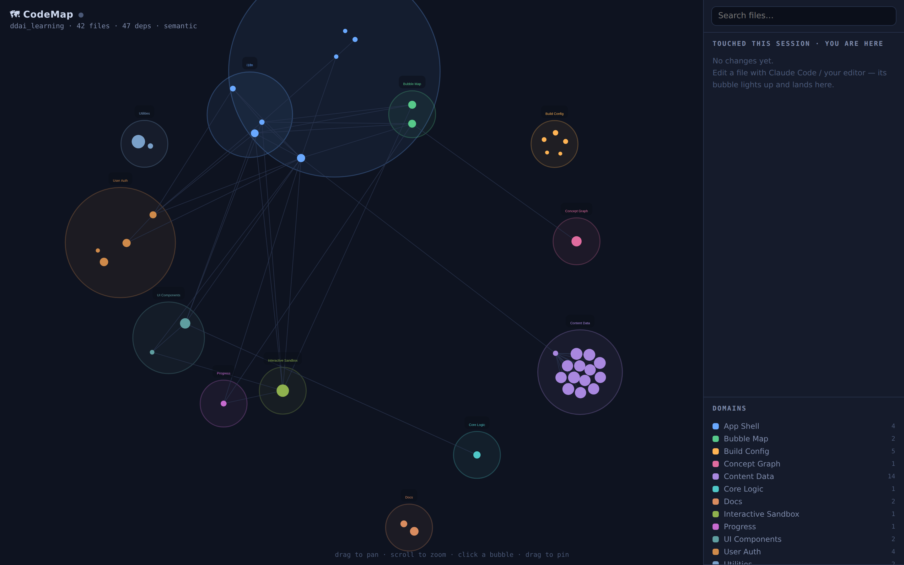
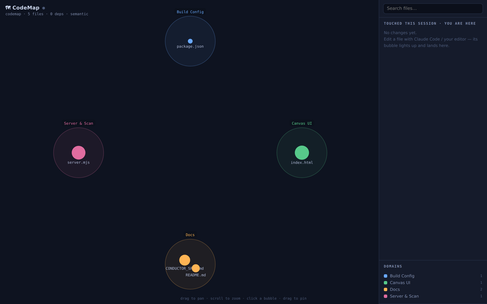
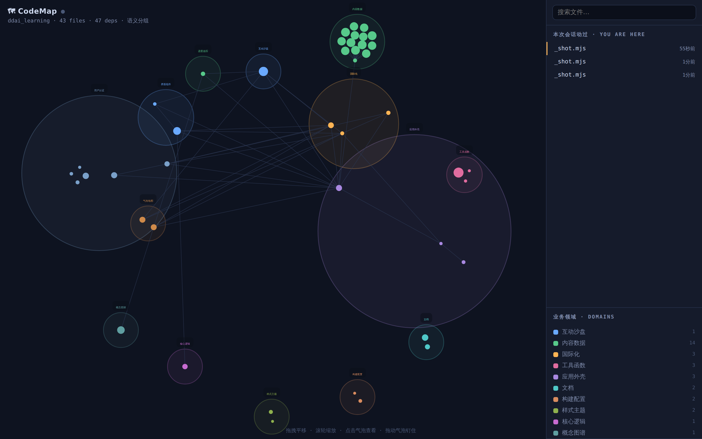

# 🗺 CodeMap



A **live spatial map of your codebase** — so you stop getting lost in the linear scroll
of AI-assisted coding. The big picture is always on screen, and when your AI tool
(Claude Code, Cursor, anything) edits a file, the matching node **lights up** and lands
on a **"you are here"** timeline.

Built for the solo PM-engineer who vibe-codes and can't see the forest for the chat log.

### More views

CodeMap pointed at **its own repo** (5 files) — same UI, any size codebase:



The UI and the domain labels are bilingual. English is shown above; the same map with
Chinese labels (`?lang=en` omitted, `CODEMAP_LANG` unset) looks like this:



## Run it

Zero dependencies. Just Node 20+.

```bash
node server.mjs /path/to/your/repo
# then open http://localhost:7100
```

Options: `--port 7100`. If you omit the repo path it uses the current directory.

Leave it open on a second monitor while you code. Edit a file → watch the node pulse.

## 🧠 Semantic grouping (LLM)

By default files are grouped by **what they do** — intuitive business domains like
*User Auth*, *Canvas Rendering*, *Data Persistence* — not by which folder they live in.
An LLM reads each file's responsibility (top comment + exported symbols + path) and
clusters same-domain files into labelled bubbles. Great when the code is in a language
you don't read fluently: the *map* reads in plain words.

Turn it on by pointing CodeMap at a model (pick one):

```bash
# 1) Anthropic — cheap & good (defaults to claude-haiku-4-5)
ANTHROPIC_API_KEY=sk-ant-... node server.mjs /path/to/repo

# 2) A local model (Ollama / LM Studio / vLLM — OpenAI-compatible)
LLM_BASE_URL=http://localhost:11434/v1 CODEMAP_MODEL=qwen2.5-coder node server.mjs /path/to/repo

# 3) OpenAI-compatible cloud
OPENAI_API_KEY=sk-... CODEMAP_MODEL=gpt-4o-mini node server.mjs /path/to/repo
```

**No key set → it just uses folder grouping**, still fully usable.

| Env var | Purpose |
|---|---|
| `ANTHROPIC_API_KEY` | Use Anthropic Claude (cheapest good option). |
| `LLM_BASE_URL` (+ optional `OPENAI_API_KEY`) | Any OpenAI-compatible endpoint, including local models. |
| `CODEMAP_MODEL` | Override the model name. |
| `CODEMAP_LANG` | Domain-label language: unset/`zh` for Chinese (default), `en` for English. |

**Language:** the interface language is per-browser (`?lang=en` in the URL); the
domain-label language is set once at scan time via `CODEMAP_LANG`. For an all-English
experience, run with `CODEMAP_LANG=en` and open `http://localhost:7100/?lang=en`.

How it behaves: the map renders instantly with folder grouping, then **upgrades in
place** to semantic domains a few seconds later (one batched call). Results cache to
`.codemap-cache.json`, keyed by each file's content digest — restarts are instant and
only changed files get re-classified.

## What it does today (v0)

- **Scans** the repo into a topology graph: files = nodes, `import`/`require` = edges,
  grouped into **domains** — by responsibility via an LLM, or by folder as a fallback —
  and clustered into labelled bubbles on a force-directed map.
- **Watches** the filesystem. Any change updates the node's `lastChanged`, pulses it,
  and prepends it to the **session timeline** (right panel).
- **"You are here"** marks the most recently touched file.
- **Click** a node → its path, line count, and its dependencies (imports / imported-by),
  each clickable to hop around.
- **Search**, **domain filter** (click a legend row to hide/show), pan / zoom, drag to pin.
- **Bilingual UI** — Chinese by default, `?lang=en` for English.

## How it's wired

```
server.mjs   Node http server, no deps.
             - scan()      walk repo → nodes + import edges
             - classify()  batched LLM pass → semantic domains (cached)
             - fs.watch    recursive watch → activity log + lastChanged
             - GET /api/state   the whole graph as JSON (frontend polls 1/s)
public/index.html   self-contained canvas app: force layout, live highlight,
                    timeline, detail popover, i18n.
```

The frontend polls `/api/state` every second, preserving node positions so the map
stays stable as files change.

## Extend it (the fun part)

✅ **LLM semantic grouping** — done (see above). `classifyDomains()` in `server.mjs`
reads file digests and names clusters by *responsibility* instead of by directory.
This is what turns a file graph into a *system* map.

📐 **Conductor** — *design spec, not yet implemented.* See [`CONDUCTOR_SPEC.md`](CONDUCTOR_SPEC.md).
Feed it a file of prompt phases and it drives a coding agent (Claude Code first, via the
Agent SDK) through them one by one — with a **mandatory verification gate after every phase**,
VS-Code-style **breakpoints**, an **emergency stop**, and an auto-pause whenever the agent
needs a secret or a decision. You watch the whole run unfold on the map. The doc is the
agreed blueprint (driver interface, pause state machine, cost model); the code is future work.

Marked `// NEXT:` in `server.mjs`:

1. **Git-aware changes** — on change, run `git diff --stat` for real lines-added/removed,
   and let a node click show the actual diff.

Other natural next steps:
- **Session bridge**: tail the Claude Code transcript and link each map change back to the
  message/decision that caused it (turn the linear log into a spatial index).
- **C4 zoom levels**: system → container → component → file, collapsing domains into
  single super-nodes until you zoom in.
- **PM view**: a read-only layer with plain-language domain labels + status per area.

Tuned for JS/TS import graphs today; other languages still get the file/domain map
(edges are just sparser) — extend the import regex per language.

## License

MIT — see [LICENSE](LICENSE).
